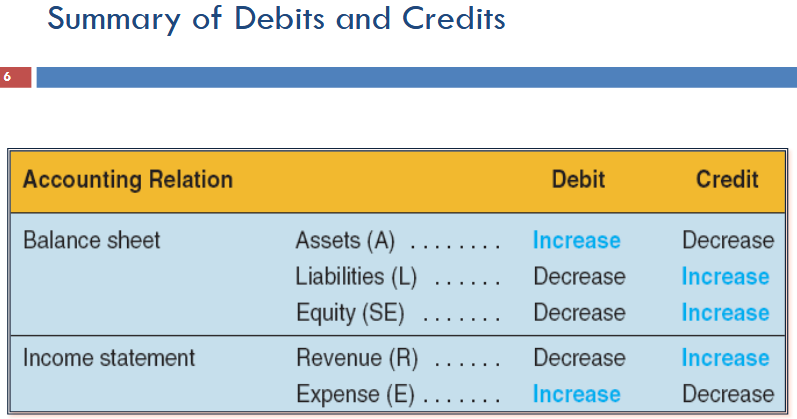

* Account: A record of increases and decreases for each asset, liability, equity, revenue or expense.
* To analyze and record a transaction, we figure what accounts are affected and in which direction (increase or decrease)
* Debit Credit System
  * Double book entry accounting requires that debits = credits.
  * Balance sheet in accounting equation form: Assets = Liability + Equity
  * Accounts are also represented via T accounts, Where debits (Dr) are on the left and credits (Cr) are on the right.

* FSET Template

* We then followed with example scenarios (Mohali Juice) and translated them into FSET statements
* Finally, built a Balance Sheet and Income statement for Mohali Juice using those scenarios.
